# PyDocAI — Architecture Reference

> **Purpose:** Complete reference for how PyDocAI works — every service, every flow, every model, every endpoint. Use this to understand the full system, debug issues, or plan changes.

---

## Table of Contents

1. [System Overview](#1-system-overview)
2. [Service Architecture](#2-service-architecture)
3. [Local Development (Docker)](#3-local-development-docker)
4. [Production (AWS)](#4-production-aws)
5. [Complete Data Flows](#5-complete-data-flows)
   - 5.1 [Single File Upload](#51-single-file-upload)
   - 5.2 [Folder/ZIP Upload](#52-folderzip-upload)
   - 5.3 [GitHub Repo Import](#53-github-repo-import)
   - 5.4 [Universal (Non-Python) Upload](#54-universal-non-python-upload)
   - 5.5 [Publish & Share](#55-publish--share)
   - 5.6 [GitHub OAuth Login](#56-github-oauth-login)
   - 5.7 [Password Reset](#57-password-reset)
   - 5.8 [Comments & Notifications](#58-comments--notifications)
6. [Service-to-Service Communication](#6-service-to-service-communication)
7. [API Endpoints](#7-api-endpoints)
8. [Data Models](#8-data-models)
9. [Package Inventory](#9-package-inventory)
10. [CI/CD Pipeline](#10-cicd-pipeline)
11. [Key Decisions](#11-key-decisions)
12. [Environment Variables](#12-environment-variables)
13. [Project Structure](#13-project-structure)
14. [Current Status](#14-current-status)

---

## 1. System Overview

PyDocAI is an **AI-powered universal documentation generator** that parses source code (any language) and produces beautiful, structured documentation using Groq AI (LLaMA) with Gemini/Claude fallbacks.

### 1.1 What It Does

| Feature | Description |
|---------|-------------|
| **AI Documentation** | Parses code, generates human-readable docs via Groq AI |
| **Universal Language Support** | Python, JavaScript, TypeScript, Java, Go, Rust, and more |
| **Python AST Mode** | Deep Python/Django AST analysis — schema tables, endpoint mapping, model relationships |
| **Multiple Input Methods** | Single `.py` files, `.zip` archives, raw code paste, GitHub repository |
| **Schema Generation** | Auto-compiled tables for DB models, field types, constraints, relationships (Python) |
| **Endpoint Mapping** | Automated REST API docs with HTTP methods, path params, JSON responses (Python) |
| **Markdown Export** | Export as clean Markdown (GitHub/GitLab/VS Code compatible) |
| **Publish & Share** | Publish docs publicly with shareable links and threaded comments |
| **JWT Authentication** | Email/password + GitHub OAuth + password reset |
| **Responsive UI** | Mobile-first dark theme, slide-in sidebar |

### 1.2 High-Level Architecture

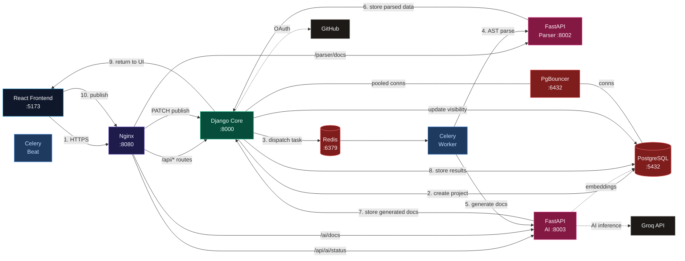
```mermaid
graph LR
    F["React Frontend<br/>:5173"]:::frontend
    N["Nginx<br/>:8080"]:::gateway
    D["Django Core<br/>:8000"]:::api
    R[("Redis<br/>:6379")]:::data
    C["Celery<br/>Worker"]:::worker
    B["Celery<br/>Beat"]:::worker
    P["FastAPI<br/>Parser :8002"]:::fastapi
    A["FastAPI<br/>AI :8003"]:::fastapi
    PG[("PostgreSQL<br/>:5432")]:::data
    PB["PgBouncer<br/>:6432"]:::data
    G["Groq API"]:::ext
    GH["GitHub"]:::ext

    F -->|1. HTTPS| N
    N -->|/api/* routes| D
    N -->|/api/ai/status| A
    N -->|/parser/docs| P
    N -->|/ai/docs| A
    D -->|2. create project| PG
    D -->|3. dispatch task| R
    R --> C
    C -->|4. AST parse| P
    C -->|5. generate docs| A
    P -->|6. store parsed data| D
    A -->|7. store generated docs| D
    A -.->|embeddings| PG
    D -->|8. store results| PG
    D -->|9. return to UI| F
    F -->|10. publish| N
    N -->|PATCH publish| D
    D -->|update visibility| PG
    D -.->|OAuth| GH
    A -.->|AI inference| G
    D ---|pooled conns| PB
    PB ---|conns| PG

    classDef frontend fill:#0f172a,stroke:#38bdf8,color:#f8fafc;
    classDef gateway fill:#1e1b4b,stroke:#a78bfa,color:#eef2ff;
    classDef api fill:#064e3b,stroke:#34d399,color:#ecfdf5;
    classDef data fill:#7f1d1d,stroke:#f87171,color:#fef2f2;
    classDef worker fill:#1e3a5f,stroke:#60a5fa,color:#bfdbfe;
    classDef fastapi fill:#831843,stroke:#f472b6,color:#fdf2f8;
    classDef ext fill:#1c1917,stroke:#a8a29e,color:#fafaf9;
```

### 1.3 Container Overview

| Container | Base | Port | Purpose |
|-----------|------|------|---------|
| `core` | Python 3.12-slim | `8000` | Django REST API — all business logic, Celery tasks, DRF views |
| `nginx` | nginx:alpine | `8080` | Reverse proxy — routes `/api/*` to core, `/api/ai/` to AI, docs to FastAPI |
| `celery` | Python 3.12-slim | — | Async task worker — AST parsing, AI generation, GitHub imports |
| `celery-beat` | Python 3.12-slim | — | Periodic task scheduler |
| `fastapi-parser` | Python 3.12-slim | `8002` | FastAPI microservice — Python AST parsing + framework detection |
| `fastapi-ai` | Python 3.12-slim | `8003` | FastAPI microservice — Groq AI doc generation + RAG embeddings |
| `db` | postgres:16-alpine | `5432` | PostgreSQL database |
| `redis` | redis:7-alpine | `6379` | Celery broker + result backend + Django cache |
| `pgbouncer` | edoburu/pgbouncer | `6432` | PostgreSQL connection pooler |

---

## 2. Service Architecture

### 2.1 Django Core (`services/core/`)

The central hub. Runs Django 5 + DRF. Handles:

- **Authentication** — JWT (simplejwt), GitHub OAuth, password reset
- **Projects CRUD** — create, read, update, delete projects and files
- **Parser orchestration** — receives uploads, dispatches Celery tasks
- **AI orchestration** — triggers AI generation via Celery → FastAPI
- **GitHub integration** — lists repos, imports code, OAuth
- **Exports** — Markdown download
- **Comments** — threaded public comments on published docs
- **Feedback** — user feedback with admin replies
- **Admin Dashboard** — platform stats, user/project management
- **Notifications** — in-app + email notifications
- **Internal API** — callbacks from FastAPI services (protected by `X-Internal-Api-Key`)
- **Universal parser** — non-Python code doc generation (AI-direct, no AST)
- **Health** — `GET /api/health/` returns `{"status": "healthy"}`

**Entrypoint** (`services/core/docker/entrypoint.sh`):
```bash
python manage.py migrate --noinput
python manage.py collectstatic --noinput
exec gunicorn config.wsgi:application --bind 0.0.0.0:8000 --workers 4
```

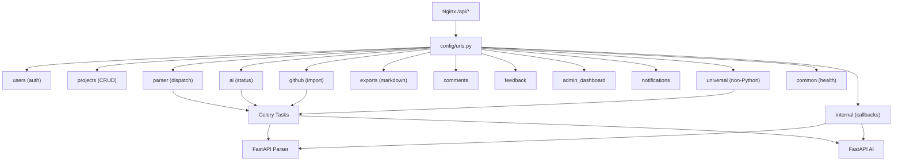
```mermaid
graph TD
    NG["Nginx /api/*"] --> URL["config/urls.py"]

    URL --> USR["users (auth)"]
    URL --> PRJ["projects (CRUD)"]
    URL --> PRS["parser (dispatch)"]
    URL --> AIV["ai (status)"]
    URL --> GIT["github (import)"]
    URL --> EXP["exports (markdown)"]
    URL --> COM2["comments"]
    URL --> FB["feedback"]
    URL --> ADM["admin_dashboard"]
    URL --> NOT2["notifications"]
    URL --> UNI2["universal (non-Python)"]
    URL --> INT["internal (callbacks)"]
    URL --> HTH["common (health)"]

    PRS --> CT["Celery Tasks"]
    AIV --> CT
    GIT --> CT
    UNI2 --> CT
    CT --> FPP["FastAPI Parser"]
    CT --> FPA["FastAPI AI"]
    INT --> FPP
    INT --> FPA
```

**14 Django Apps:**

| App | Path | Purpose |
|-----|------|---------|
| `users` | `apps/users/` | User model, auth views, JWT, password reset |
| `projects` | `apps/projects/` | Project + ProjectFile CRUD, publish, public views |
| `parser` | `apps/parser/` | Celery tasks that call FastAPI Parser |
| `ai` | `apps/ai/` | AI status endpoint, AI-related views |
| `universal` | `apps/universal/` | Non-Python doc generation (AI-direct) |
| `github_integration` | `apps/github_integration/` | GitHub API, repo list, repo import |
| `exports` | `apps/exports/` | Markdown export |
| `comments` | `apps/comments/` | Threaded public comments |
| `feedback` | `apps/feedback/` | User feedback with admin replies |
| `admin_dashboard` | `apps/admin_dashboard/` | Admin stats, user/project management |
| `notifications` | `apps/notifications/` | In-app + email notifications |
| `common` | `apps/common/` | Shared utilities, health check |
| `internal` | `apps/internal/` | FastAPI → Django callback endpoints |
| `parser_utils` | `apps/parser/utils/` | AST parser, validators (local fallback) |

### 2.2 FastAPI Parser (`services/parser/`)

Stateless microservice. Receives code via Celery worker → parses Python AST → stores results via Django Internal API.

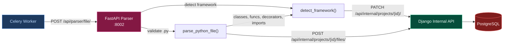
```mermaid
graph LR
    CEL["Celery Worker"] -->|"POST /api/parser/file/"| FP["FastAPI Parser<br/>:8002"]
    FP -->|validate .py| AST["parse_python_file()"]
    FP -->|detect framework| FD["detect_framework()"]
    AST -->|classes, funcs, decorators, imports| FD
    FD -->|"PATCH /api/internal/projects/{id}/"| DIA["Django Internal API"]
    AST -->|"POST /api/internal/projects/{id}/files/"| DIA
    DIA --> DB[("PostgreSQL")]

    classDef fastapi fill:#831843,stroke:#f472b6,color:#fdf2f8
    classDef api fill:#064e3b,stroke:#34d399,color:#ecfdf5
    classDef data fill:#7f1d1d,stroke:#f87171,color:#fef2f2
    classDef worker fill:#1e3a5f,stroke:#60a5fa,color:#bfdbfe
    class FP fastapi
    class CEL worker
    class DIA api
    class DB data
```

**Endpoints:**

| Method | Path | Description |
|--------|------|-------------|
| GET | `/health` | Healthcheck |
| POST | `/api/parser/file/` | Parse single .py file (multipart) |
| POST | `/api/parser/folder/` | Parse .zip of .py files (multipart) |
| GET | `/api/parser/status/{project_id}` | Check parsing status |

**How it works:**
1. Receives file content + metadata
2. Validates Python syntax
3. Runs `parse_python_file()` — AST extraction (classes, functions, methods, decorators, docstrings, imports, async defs)
4. Runs `detect_framework()` — identifies Django, DRF, FastAPI patterns from imports
5. Calls Django Internal API to store `ProjectFile` + update Project with `framework_info`
6. Returns parsed data

### 2.3 FastAPI AI (`services/ai/`)

Stateless microservice. Receives parsed project data → generates documentation via Groq LLM → stores results via Django Internal API.

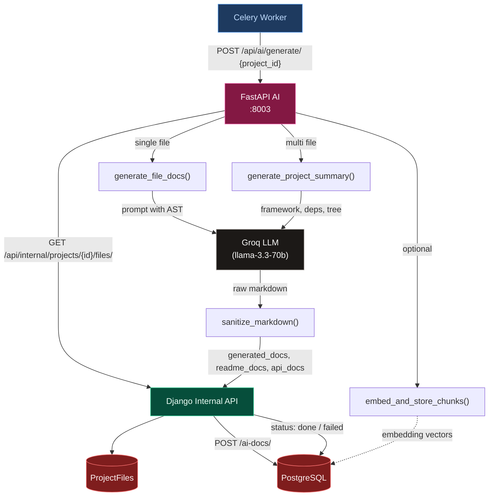
```mermaid
graph TD
    CEL["Celery Worker"] -->|"POST /api/ai/generate/ {project_id}"| FA["FastAPI AI<br/>:8003"]
    FA -->|"GET /api/internal/projects/{id}/files/"| DIA["Django Internal API"]
    DIA --> PF[(ProjectFiles)]
    FA -->|single file| SD["generate_file_docs()"]
    FA -->|multi file| MP["generate_project_summary()"]
    FA -->|optional| RAG["embed_and_store_chunks()"]
    SD -->|prompt with AST| GROQ["Groq LLM<br/>(llama-3.3-70b)"]
    MP -->|framework, deps, tree| GROQ
    GROQ -->|raw markdown| SAN["sanitize_markdown()"]
    SAN -->|generated_docs, readme_docs, api_docs| DIA
    DIA -->|"POST /ai-docs/"| DB[("PostgreSQL")]
    DIA -->|"status: done / failed"| DB
    RAG -.->|embedding vectors| DB

    classDef fastapi fill:#831843,stroke:#f472b6,color:#fdf2f8
    classDef api fill:#064e3b,stroke:#34d399,color:#ecfdf5
    classDef data fill:#7f1d1d,stroke:#f87171,color:#fef2f2
    classDef worker fill:#1e3a5f,stroke:#60a5fa,color:#bfdbfe
    classDef ext fill:#1c1917,stroke:#a8a29e,color:#fafaf9
    class FA fastapi
    class CEL worker
    class DIA api
    class PF,DB data
    class GROQ ext
```

**Endpoints:**

| Method | Path | Description |
|--------|------|-------------|
| GET | `/health` | Healthcheck (groq key status, embedding model) |
| POST | `/api/ai/generate/` | Generate docs from parsed files (JSON body) |
| GET | `/api/ai/status/{project_id}` | Check AI generation status |

**How it works:**
1. Receives `project_id`
2. Fetches all `ProjectFile` records from Django Internal API
3. Single file: `generate_file_docs()` → Groq LLM → sanitize markdown
4. Multi-file/folder:
   a. Writes files to temp directory
   b. `generate_project_summary()` — detects framework, apps, deps, file tree
   c. Optionally embeds chunks via `embed_and_store_chunks()` (RAG)
   d. `build_api_docs()` — endpoint documentation
   e. Groq prompt (llama-3.3-70b-versatile) → `generated_docs` + `readme_docs`
   f. `sanitize_markdown()` — clean up LLM output
5. Calls Django Internal API → `send_ai_docs()` to store results
6. Sets Project → `DONE` (or `FAILED` on error)

**AI Provider fallback chain:**

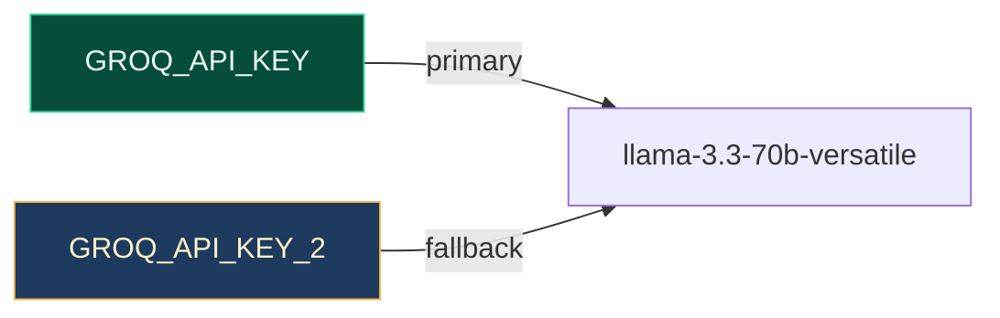
```mermaid
graph LR
    GR1["GROQ_API_KEY"]:::primary -->|primary| LLM["llama-3.3-70b-versatile"]
    GR2["GROQ_API_KEY_2"]:::fallback -->|fallback| LLM

    classDef primary fill:#064e3b,stroke:#34d399,color:#ecfdf5
    classDef fallback fill:#1e3a5f,stroke:#fbb24f,color:#fef3c7
```

### 2.4 Celery Worker (`celery`)

Runs the same Docker image as `core`. Auto-discovers tasks from `INSTALLED_APPS`.

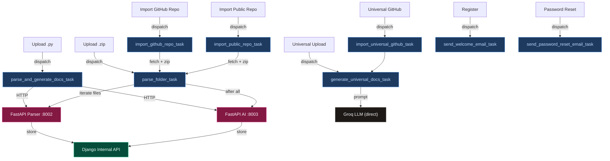
```mermaid
graph TD
    FILE["Upload .py"] -->|"dispatch"| PG["parse_and_generate_docs_task"]
    FOLD["Upload .zip"] -->|"dispatch"| PF["parse_folder_task"]
    GHUB["Import GitHub Repo"] -->|"dispatch"| IG["import_github_repo_task"]
    GHUB2["Import Public Repo"] -->|"dispatch"| IP["import_public_repo_task"]
    UNI["Universal Upload"] -->|"dispatch"| GU["generate_universal_docs_task"]
    UNIGH["Universal GitHub"] -->|"dispatch"| IUG["import_universal_github_task"]
    REG["Register"] -->|"dispatch"| WE["send_welcome_email_task"]
    RESET["Password Reset"] -->|"dispatch"| PRE["send_password_reset_email_task"]

    PG -->|HTTP| FPP["FastAPI Parser :8002"]
    PG -->|HTTP| FPA["FastAPI AI :8003"]
    PF -->|iterate files| FPP
    PF -->|after all| FPA
    IG -->|fetch + zip| PF
    IP -->|fetch + zip| PF
    IUG --> GU
    GU -->|prompt| GROQ["Groq LLM (direct)"]
    FPP -->|store| DIA["Django Internal API"]
    FPA -->|store| DIA

    classDef task fill:#1e3a5f,stroke:#60a5fa,color:#bfdbfe
    classDef fastapi fill:#831843,stroke:#f472b6,color:#fdf2f8
    classDef api fill:#064e3b,stroke:#34d399,color:#ecfdf5
    classDef ext fill:#1c1917,stroke:#a8a29e,color:#fafaf9
    class PG,PF,IG,IP,GU,IUG,WE,PRE task
    class FPP,FPA fastapi
    class DIA api
    class GROQ ext
```

**All Celery Tasks:**

| Task | App | Trigger | What It Does |
|------|-----|---------|--------------|
| `parse_and_generate_docs_task` | parser | File upload | Sends file to FastAPI Parser → AI → stores results |
| `parse_folder_task` | parser | Folder upload | Iterates ZIP files → Parser per file → AI → stores |
| `import_github_repo_task` | github_integration | GitHub import | Fetches repo → builds ZIP → delegates to `parse_folder_task` |
| `import_public_repo_task` | github_integration | Public repo import | Same without OAuth token |
| `generate_universal_docs_task` | universal | Universal upload | AI-direct doc gen (no AST), validates output |
| `import_universal_github_task` | universal | Universal GitHub import | Downloads all files → delegates to `generate_universal_docs_task` |
| `send_welcome_email_task` | users | Registration | Sends welcome email |
| `send_password_reset_email_task` | users | Password reset | Sends reset email |
| `send_feedback_confirmation_task` | feedback | Feedback submit | Sends confirmation email |
| `send_feedback_reply_task` | feedback | Admin reply | Sends reply notification |
| `send_email_task` | notifications | Comments | Generic email sending |

### 2.5 Celery Beat (`celery-beat`)

Scheduled periodic tasks (currently none configured — ready for cleanup, retry, or notification tasks).

### 2.6 Nginx (`nginx`)

Routes all traffic to the correct internal service.

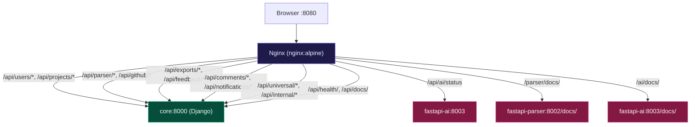
```mermaid
graph TD
    BROWSER["Browser :8080"] --> NGINX["Nginx (nginx:alpine)"]
    NGINX -->|"/api/users/*, /api/projects/*"| D1["core:8000 (Django)"]
    NGINX -->|"/api/parser/*, /api/github/*"| D1
    NGINX -->|"/api/exports/*, /api/feedback/*"| D1
    NGINX -->|"/api/comments/*, /api/notifications/*"| D1
    NGINX -->|"/api/universal/*, /api/internal/*"| D1
    NGINX -->|"/api/health/, /api/docs/"| D1
    NGINX -->|"/api/ai/status"| AI["fastapi-ai:8003"]
    NGINX -->|"/parser/docs/"| PD["fastapi-parser:8002/docs/"]
    NGINX -->|"/ai/docs/"| AD["fastapi-ai:8003/docs/"]

    style NGINX fill:#1e1b4b,stroke:#a78bfa,color:#eef2ff
    style D1 fill:#064e3b,stroke:#34d399,color:#ecfdf5
    style AI fill:#831843,stroke:#f472b6,color:#fdf2f8
    style PD fill:#831843,stroke:#f472b6,color:#fdf2f8
    style AD fill:#831843,stroke:#f472b6,color:#fdf2f8
```

**Key routing rules:**

| Route | Target | Why |
|-------|--------|-----|
| `/api/users/`, `/api/projects/`, `/api/parser/`, etc. | `core:8000` | All Django API routes |
| `/api/ai/status` | `fastapi-ai:8003` | Direct to AI microservice (status endpoint) |
| `/parser/docs/` | `fastapi-parser:8002/docs/` | FastAPI Swagger UI |
| `/ai/docs/` | `fastapi-ai:8003/docs/` | FastAPI Swagger UI |
| `/` | Static files or 404 | Not used in dev (frontend on :5173) |

All `/api/*` routes add `X-Internal-Api-Key` header for inter-service auth.

### 2.7 PgBouncer (`pgbouncer`)

PostgreSQL connection pooler in **transaction mode**.

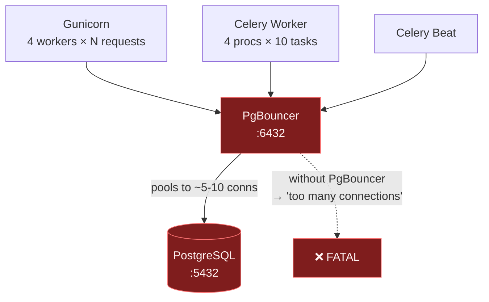
```mermaid
graph TD
    GUN["Gunicorn<br/>4 workers × N requests"] --> PB["PgBouncer<br/>:6432"]
    CEL["Celery Worker<br/>4 procs × 10 tasks"] --> PB
    CB["Celery Beat"] --> PB
    PB -->|"pools to ~5-10 conns"| PG[("PostgreSQL<br/>:5432")]
    PB -.->|"without PgBouncer<br/>→ 'too many connections'"| ERR["❌ FATAL"]

    style PB fill:#7f1d1d,stroke:#f87171,color:#fef2f2
    style PG fill:#7f1d1d,stroke:#f87171,color:#fef2f2
    style ERR fill:#7f1d1d,stroke:#f87171,color:#fef2f2
```

Without PgBouncer, these would exhaust the RDS free tier connection limit (~20).

---

## 3. Local Development (Docker)

### 3.1 SQLite Mode (Default for Local Dev)

Unlike production (PostgreSQL), local Docker development uses **SQLite** via `config.settings.development`.

**Why SQLite for local dev:**
- No Postgres dependency — skips `db`, `pgbouncer` from depends_on
- Faster container startup
- No data persistence issues (SQLite file in container)
- Migrations apply instantly
- pgvector embeddings not needed locally

**How it's configured:**
```yaml
# docker-compose.yml — core, celery, celery-beat
environment:
  - DJANGO_SETTINGS_MODULE=config.settings.development
```

`config/settings/development.py`:
```python
DATABASES = {
    'default': {
        'ENGINE': 'django.db.backends.sqlite3',
        'NAME': BASE_DIR / 'db.sqlite3',
    }
}
CELERY_BROKER_URL = config('CELERY_BROKER_URL', default='redis://localhost:6379/0')
```

The `CELERY_BROKER_URL` default is overridden by Docker compose env → `redis://redis:6379/0`. Redis and Celery still work.

### 3.2 `docker-compose.yml` — 9 Containers

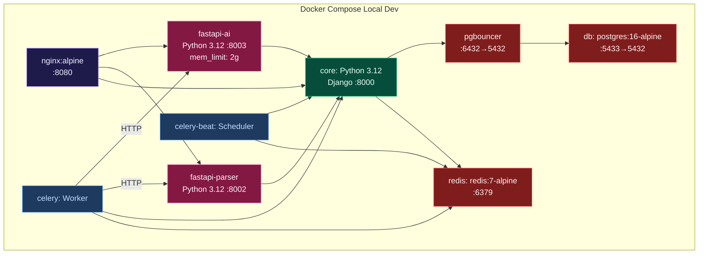
```mermaid
graph TB
    subgraph "Docker Compose Local Dev"
        NGINX["nginx:alpine<br/>:8080"]:::gateway
        CORE["core: Python 3.12<br/>Django :8000"]:::api
        CEL["celery: Worker"]:::worker
        CB["celery-beat: Scheduler"]:::worker
        FP["fastapi-parser<br/>Python 3.12 :8002"]:::fastapi
        FA["fastapi-ai<br/>Python 3.12 :8003<br/>mem_limit: 2g"]:::fastapi
        PG["db: postgres:16-alpine<br/>:5433→5432"]:::data
        RD["redis: redis:7-alpine<br/>:6379"]:::data
        PB["pgbouncer<br/>:6432→5432"]:::data

        NGINX --> CORE
        NGINX --> FP
        NGINX --> FA
        CORE --> RD
        CORE --> PB
        CEL --> RD
        CEL --> CORE
        CB --> RD
        CB --> CORE
        CEL -->|HTTP| FP
        CEL -->|HTTP| FA
        FP --> CORE
        FA --> CORE
        PB --> PG
    end

    classDef gateway fill:#1e1b4b,stroke:#a78bfa,color:#eef2ff
    classDef api fill:#064e3b,stroke:#34d399,color:#ecfdf5
    classDef worker fill:#1e3a5f,stroke:#60a5fa,color:#bfdbfe
    classDef fastapi fill:#831843,stroke:#f472b6,color:#fdf2f8
    classDef data fill:#7f1d1d,stroke:#f87171,color:#fef2f2
```

```yaml
networks:
  pydocai-net:     # All services on this network

volumes:
  postgres_data:   # PG data persistence
  pydocai_static_volume:  # collectstatic output
  model_cache:     # HuggingFace embedding cache

services:
  core:       python:3.12-slim, :8000, depends_on: [redis, db]
  nginx:      nginx:alpine, :8080→80, depends_on: [core, fastapi-parser, fastapi-ai]
  celery:     python:3.12-slim, no ports, depends_on: [redis, core]
  celery-beat: python:3.12-slim, no ports, depends_on: [redis, core]
  fastapi-parser: python:3.12-slim, :8002
  fastapi-ai:     python:3.12-slim, :8003, mem_limit: 2g
  db:         postgres:16-alpine, :5433→5432
  redis:      redis:7-alpine, :6379
  pgbouncer:  edoburu/pgbouncer, :6432→5432
```

**Healthchecks:**
- `core`: `curl --fail http://localhost:8000/api/health/ || exit 1`
- `db`: `pg_isready -U pydocai_user -d pydocai`
- `fastapi-parser`: `curl --fail http://localhost:8002/health || exit 1`
- `fastapi-ai`: `curl --fail http://localhost:8003/health || exit 1`

### 3.3 Quick Start

```bash
docker-compose up --build -d
```

| Service | URL |
|---------|-----|
| Frontend (Vite dev) | http://localhost:5173 |
| API (via nginx) | http://localhost:8080 |
| Django Swagger | http://localhost:8080/api/docs/ |
| Parser Swagger | http://localhost:8080/parser/docs/ |
| AI Swagger | http://localhost:8080/ai/docs/ |

### 3.4 Seed Data

```bash
docker exec -it pydocai-core-1 python manage.py shell < seed/seed_admin.py
```

Creates admin user: `admin@gmail.com` / `admin1234`

---

## 4. Production (AWS)

### 4.1 Infrastructure (Free Tier)

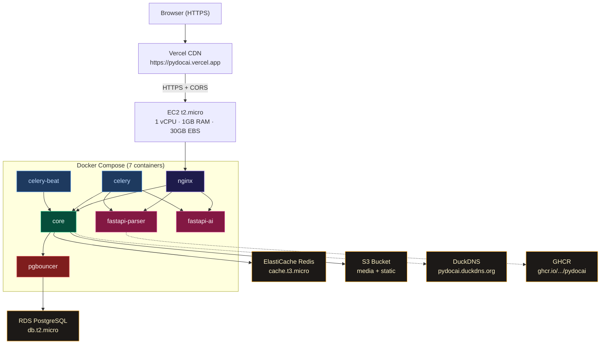
```mermaid
graph TB
    B["Browser (HTTPS)"] --> V["Vercel CDN<br/>https://pydocai.vercel.app"]
    V -->|HTTPS + CORS| EC2["EC2 t2.micro<br/>1 vCPU · 1GB RAM · 30GB EBS"]
    
    subgraph "Docker Compose (7 containers)"
        NG["nginx"]:::gateway
        CO["core"]:::api
        CE["celery"]:::worker
        CBE["celery-beat"]:::worker
        FP["fastapi-parser"]:::fastapi
        FA["fastapi-ai"]:::fastapi
        PB["pgbouncer"]:::data
    end

    EC2 --> NG
    NG --> CO
    NG --> FP
    NG --> FA
    CO --> PB
    CE --> CO
    CBE --> CO
    CE --> FP
    CE --> FA

    PB --> RDS["RDS PostgreSQL<br/>db.t2.micro"]:::aws
    CO --> ELC["ElastiCache Redis<br/>cache.t3.micro"]:::aws
    CO --> S3["S3 Bucket<br/>media + static"]:::aws
    CO -.-> DD["DuckDNS<br/>pydocai.duckdns.org"]:::aws
    FP -.-> GHCR["GHCR<br/>ghcr.io/.../pydocai"]:::aws

    classDef gateway fill:#1e1b4b,stroke:#a78bfa,color:#eef2ff
    classDef api fill:#064e3b,stroke:#34d399,color:#ecfdf5
    classDef worker fill:#1e3a5f,stroke:#60a5fa,color:#bfdbfe
    classDef fastapi fill:#831843,stroke:#f472b6,color:#fdf2f8
    classDef data fill:#7f1d1d,stroke:#f87171,color:#fef2f2
    classDef aws fill:#1c1917,stroke:#f59e0b,color:#fef3c7
```

| AWS Service | Resource | Purpose |
|-------------|----------|---------|
| **Vercel** | CDN | Frontend hosting (static files, HTTPS, global edge) |
| **EC2** | t2.micro (1 vCPU, 1GB RAM, 30GB EBS) | Docker Compose with app containers |
| **RDS** | db.t2.micro (1 vCPU, 1GB RAM, 20GB gp2) | PostgreSQL — automated backups, patches |
| **ElastiCache** | cache.t3.micro (0.5GB RAM) | Redis — Celery broker + cache |
| **S3** | Bucket | File storage (uploaded code + static assets) |
| **DuckDNS** | pydocai.duckdns.org | Public domain → Elastic IP |
| **GHCR** | ghcr.io/dennisjoseph2025/pydocai | Docker image registry |

### 4.2 `docker-compose.prod.yml` — 7 Containers (No db/redis)

Only app containers run on EC2 (no `db` or `redis` — those are AWS managed services):

```
core ─── PgBouncer ─── RDS PostgreSQL
celery ─── ElastiCache Redis
celery-beat
fastapi-parser
fastapi-ai
nginx
```

Uses variable substitution from `~/.env`:
```yaml
environment:
  - DATABASE_URL=postgres://${DB_USER}:${DB_PASSWORD}@${DB_HOST}:${DB_PORT}/${DB_NAME}
  - AUTH_TYPE=scram-sha-256
```

### 4.3 Production Entrypoint

```bash
python manage.py migrate --noinput
python manage.py collectstatic --noinput    # Uploads to S3 (django-storages)
exec gunicorn config.wsgi:application \
  --bind 0.0.0.0:8000 \
  --worker-class gevent \
  --workers 4
```

---

## 5. Complete Data Flows

### 5.1 Single File Upload

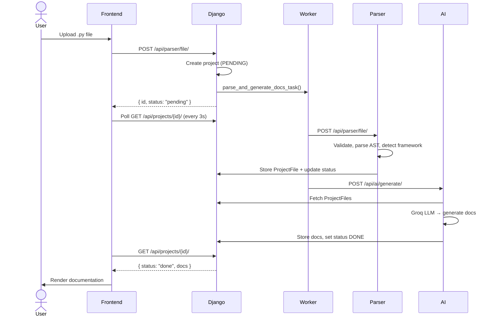
```mermaid
sequenceDiagram
    actor U as User
    participant UI as Frontend
    participant API as Django
    participant W as Worker
    participant P as Parser
    participant A as AI

    U->>UI: Upload .py file
    UI->>API: POST /api/parser/file/
    API->>API: Create project (PENDING)
    API->>W: parse_and_generate_docs_task()
    API-->>UI: { id, status: "pending" }
    UI->>API: Poll GET /api/projects/{id}/ (every 3s)

    W->>P: POST /api/parser/file/
    P->>P: Validate, parse AST, detect framework
    P->>API: Store ProjectFile + update status

    W->>A: POST /api/ai/generate/
    A->>API: Fetch ProjectFiles
    A->>A: Groq LLM → generate docs
    A->>API: Store docs, set status DONE

    UI->>API: GET /api/projects/{id}/
    API-->>UI: { status: "done", docs }
    UI->>U: Render documentation
```

### 5.2 Folder/ZIP Upload

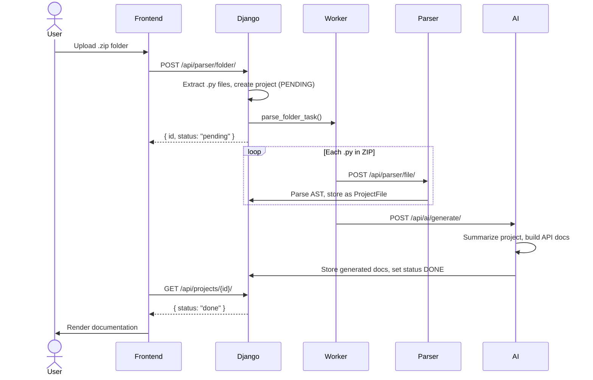
```mermaid
sequenceDiagram
    actor U as User
    participant UI as Frontend
    participant API as Django
    participant W as Worker
    participant P as Parser
    participant A as AI

    U->>UI: Upload .zip folder
    UI->>API: POST /api/parser/folder/
    API->>API: Extract .py files, create project (PENDING)
    API->>W: parse_folder_task()
    API-->>UI: { id, status: "pending" }

    loop Each .py in ZIP
        W->>P: POST /api/parser/file/
        P->>API: Parse AST, store as ProjectFile
    end

    W->>A: POST /api/ai/generate/
    A->>A: Summarize project, build API docs
    A->>API: Store generated docs, set status DONE

    UI->>API: GET /api/projects/{id}/
    API-->>UI: { status: "done" }
    UI->>U: Render documentation
```

### 5.3 GitHub Repo Import

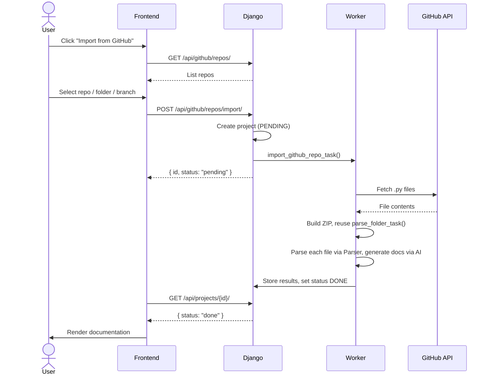
```mermaid
sequenceDiagram
    actor U as User
    participant UI as Frontend
    participant API as Django
    participant W as Worker
    participant GH as GitHub API

    U->>UI: Click "Import from GitHub"
    UI->>API: GET /api/github/repos/
    API-->>UI: List repos
    U->>UI: Select repo / folder / branch

    UI->>API: POST /api/github/repos/import/
    API->>API: Create project (PENDING)
    API->>W: import_github_repo_task()
    API-->>UI: { id, status: "pending" }

    W->>GH: Fetch .py files
    GH-->>W: File contents
    W->>W: Build ZIP, reuse parse_folder_task()
    W->>W: Parse each file via Parser, generate docs via AI
    W->>API: Store results, set status DONE

    UI->>API: GET /api/projects/{id}/
    API-->>UI: { status: "done" }
    UI->>U: Render documentation
```

### 5.4 Universal (Non-Python) Upload

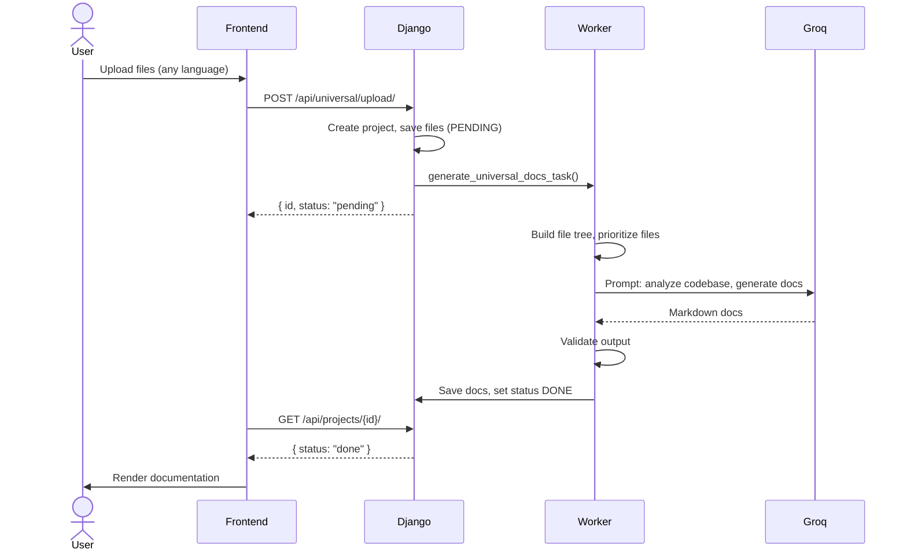
```mermaid
sequenceDiagram
    actor U as User
    participant UI as Frontend
    participant API as Django
    participant W as Worker
    participant G as Groq

    U->>UI: Upload files (any language)
    UI->>API: POST /api/universal/upload/
    API->>API: Create project, save files (PENDING)
    API->>W: generate_universal_docs_task()
    API-->>UI: { id, status: "pending" }

    W->>W: Build file tree, prioritize files
    W->>G: Prompt: analyze codebase, generate docs
    G-->>W: Markdown docs
    W->>W: Validate output
    W->>API: Save docs, set status DONE

    UI->>API: GET /api/projects/{id}/
    API-->>UI: { status: "done" }
    UI->>U: Render documentation
```

### 5.5 Publish & Share

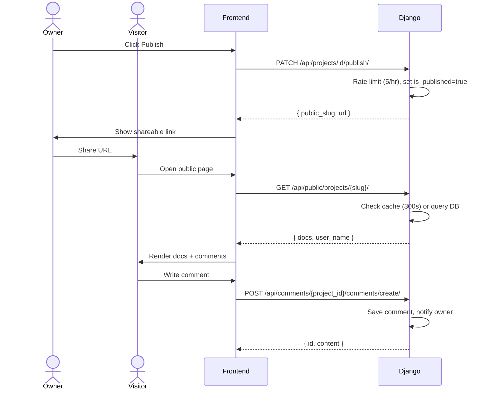
```mermaid
sequenceDiagram
    actor O as Owner
    actor V as Visitor
    participant UI as Frontend
    participant API as Django

    O->>UI: Click Publish
    UI->>API: PATCH /api/projects/id/publish/
    API->>API: Rate limit (5/hr), set is_published=true
    API-->>UI: { public_slug, url }
    UI->>O: Show shareable link

    O->>V: Share URL
    V->>UI: Open public page
    UI->>API: GET /api/public/projects/{slug}/
    API->>API: Check cache (300s) or query DB
    API-->>UI: { docs, user_name }
    UI->>V: Render docs + comments

    V->>UI: Write comment
    UI->>API: POST /api/comments/{project_id}/comments/create/
    API->>API: Save comment, notify owner
    API-->>UI: { id, content }
```

### 5.6 GitHub OAuth Login

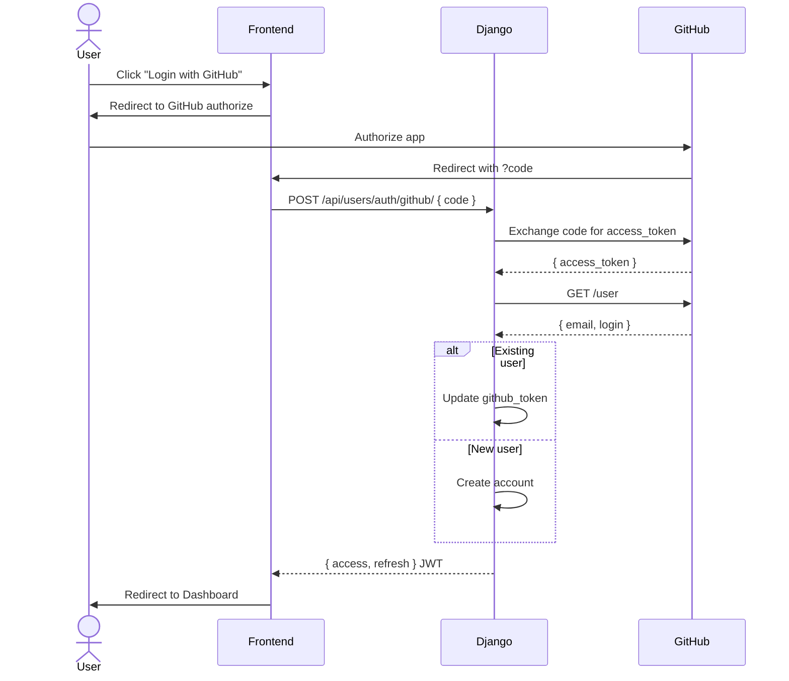
```mermaid
sequenceDiagram
    actor U as User
    participant UI as Frontend
    participant API as Django
    participant GH as GitHub

    U->>UI: Click "Login with GitHub"
    UI->>U: Redirect to GitHub authorize
    U->>GH: Authorize app
    GH->>UI: Redirect with ?code

    UI->>API: POST /api/users/auth/github/ { code }
    API->>GH: Exchange code for access_token
    GH-->>API: { access_token }
    API->>GH: GET /user
    GH-->>API: { email, login }

    alt Existing user
        API->>API: Update github_token
    else New user
        API->>API: Create account
    end

    API-->>UI: { access, refresh } JWT
    UI->>U: Redirect to Dashboard
```

### 5.7 Password Reset

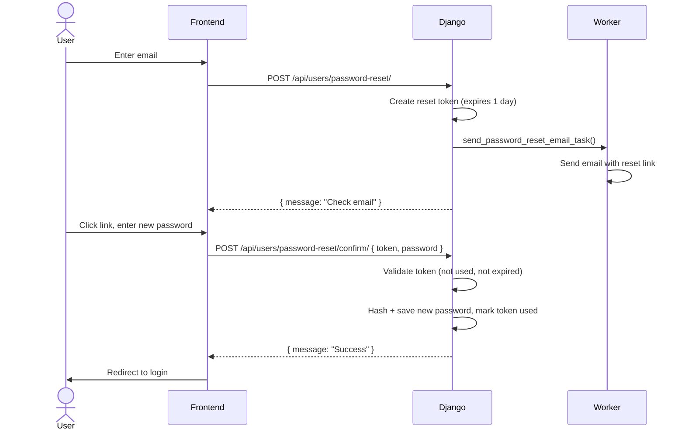
```mermaid
sequenceDiagram
    actor U as User
    participant UI as Frontend
    participant API as Django
    participant W as Worker

    U->>UI: Enter email
    UI->>API: POST /api/users/password-reset/
    API->>API: Create reset token (expires 1 day)
    API->>W: send_password_reset_email_task()
    W->>W: Send email with reset link
    API-->>UI: { message: "Check email" }

    U->>UI: Click link, enter new password
    UI->>API: POST /api/users/password-reset/confirm/ { token, password }
    API->>API: Validate token (not used, not expired)
    API->>API: Hash + save new password, mark token used
    API-->>UI: { message: "Success" }
    UI->>U: Redirect to login
```

### 5.8 Comments & Notifications

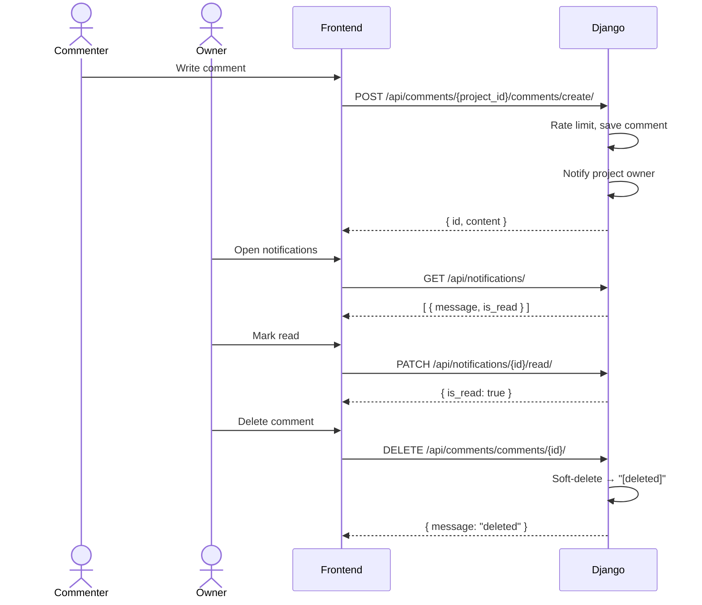
```mermaid
sequenceDiagram
    actor C as Commenter
    actor O as Owner
    participant UI as Frontend
    participant API as Django

    C->>UI: Write comment
    UI->>API: POST /api/comments/{project_id}/comments/create/
    API->>API: Rate limit, save comment
    API->>API: Notify project owner
    API-->>UI: { id, content }

    O->>UI: Open notifications
    UI->>API: GET /api/notifications/
    API-->>UI: [ { message, is_read } ]

    O->>UI: Mark read
    UI->>API: PATCH /api/notifications/{id}/read/
    API-->>UI: { is_read: true }

    O->>UI: Delete comment
    UI->>API: DELETE /api/comments/comments/{id}/
    API->>API: Soft-delete → "[deleted]"
    API-->>UI: { message: "deleted" }
```

---

## 6. Service-to-Service Communication

### 6.1 Communication Map

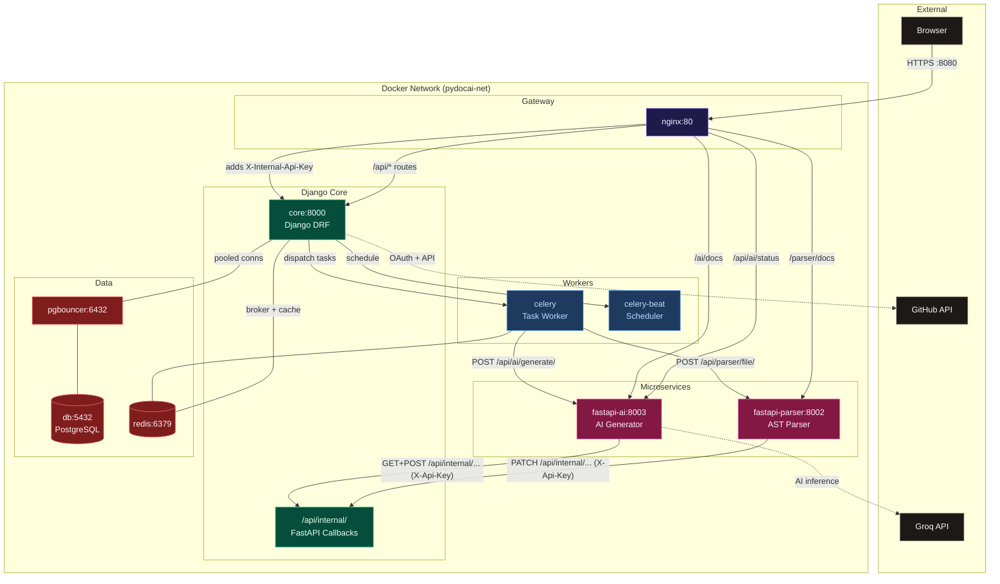
```mermaid
graph TB
    subgraph "External"
        BR["Browser"]:::ext
        GH["GitHub API"]:::ext
        GR["Groq API"]:::ext
    end

    subgraph "Docker Network (pydocai-net)"
        subgraph "Gateway"
            N["nginx:80"]:::gateway
        end

        subgraph "Django Core"
            D["core:8000<br/>Django DRF"]:::api
            I["/api/internal/<br/>FastAPI Callbacks"]:::api
        end

        subgraph "Workers"
            C["celery<br/>Task Worker"]:::worker
            CB["celery-beat<br/>Scheduler"]:::worker
        end

        subgraph "Microservices"
            FP["fastapi-parser:8002<br/>AST Parser"]:::fastapi
            FA["fastapi-ai:8003<br/>AI Generator"]:::fastapi
        end

        subgraph "Data"
            PG[("db:5432<br/>PostgreSQL")]:::data
            RD[("redis:6379")]:::data
            PB["pgbouncer:6432"]:::data
        end
    end

    BR -->|"HTTPS :8080"| N
    N -->|"/api/* routes"| D
    N -->|"/api/ai/status"| FA
    N -->|"/parser/docs"| FP
    N -->|"/ai/docs"| FA
    N -->|"adds X-Internal-Api-Key"| D

    D -->|"dispatch tasks"| C
    D -->|"schedule"| CB
    C -->|"POST /api/parser/file/"| FP
    C -->|"POST /api/ai/generate/"| FA
    FP -->|"PATCH /api/internal/... (X-Api-Key)"| I
    FA -->|"GET+POST /api/internal/... (X-Api-Key)"| I

    D ---|"pooled conns"| PB
    PB --- PG
    D ---|"broker + cache"| RD
    C --- RD
    FA -.->|"AI inference"| GR
    D -.->|"OAuth + API"| GH

    classDef ext fill:#1c1917,stroke:#a8a29e,color:#fafaf9
    classDef gateway fill:#1e1b4b,stroke:#a78bfa,color:#eef2ff
    classDef api fill:#064e3b,stroke:#34d399,color:#ecfdf5
    classDef worker fill:#1e3a5f,stroke:#60a5fa,color:#bfdbfe
    classDef fastapi fill:#831843,stroke:#f472b6,color:#fdf2f8
    classDef data fill:#7f1d1d,stroke:#f87171,color:#fef2f2
```

### 6.2 Django Internal API (`/api/internal/`)

All endpoints protected by `InternalAuthMixin` — checks `X-Internal-Api-Key` header (value: `pydocai-internal-key`).

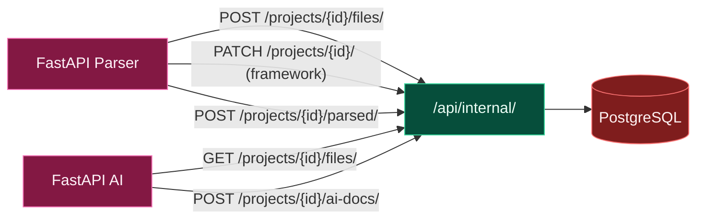
```mermaid
graph LR
    FP["FastAPI Parser"]:::fastapi -->|"POST /projects/{id}/files/"| INT["/api/internal/"]:::api
    FP -->|"PATCH /projects/{id}/ (framework)"| INT
    FP -->|"POST /projects/{id}/parsed/"| INT
    FA["FastAPI AI"]:::fastapi -->|"GET /projects/{id}/files/"| INT
    FA -->|"POST /projects/{id}/ai-docs/"| INT
    INT --> DB[("PostgreSQL")]:::data

    classDef fastapi fill:#831843,stroke:#f472b6,color:#fdf2f8
    classDef api fill:#064e3b,stroke:#34d399,color:#ecfdf5
    classDef data fill:#7f1d1d,stroke:#f87171,color:#fef2f2
```

| Method | Endpoint | Called By | Purpose |
|--------|----------|-----------|---------|
| GET | `/api/internal/projects/{id}/` | Parser, AI | Fetch project details |
| PATCH | `/api/internal/projects/{id}/` | Parser, AI | Update status, framework_info, etc. |
| POST | `/api/internal/projects/{id}/files/` | Parser | Create ProjectFile with parsed data |
| GET | `/api/internal/projects/{id}/files/` | AI | Fetch all ProjectFiles for doc gen |
| POST | `/api/internal/projects/{id}/parsed/` | Parser | Send parsed_data, update status |
| POST | `/api/internal/projects/{id}/ai-docs/` | AI | Store generated docs, set status DONE/FAILED |

### 6.3 Authentication Between Services

```mermaid
graph LR
    N["Nginx"]:::gateway -->|"adds header"| D["Django Core"]:::api
    C["Celery"]:::worker -->|"POST /parser/file/ (internal net)"| FP["FastAPI Parser"]:::fastapi
    C -->|"POST /ai/generate/ (internal net)"| FA["FastAPI AI"]:::fastapi
    FP -->|"X-Internal-Api-Key"| DI["Django Internal API"]:::api
    FA -->|"X-Internal-Api-Key"| DI

    classDef gateway fill:#1e1b4b,stroke:#a78bfa,color:#eef2ff
    classDef api fill:#064e3b,stroke:#34d399,color:#ecfdf5
    classDef worker fill:#1e3a5f,stroke:#60a5fa,color:#bfdbfe
    classDef fastapi fill:#831843,stroke:#f472b6,color:#fdf2f8
```

---

## 7. API Endpoints

### 7.1 Authentication

| Method | Endpoint | View | Auth | Rate Limit |
|--------|----------|------|------|-----------|
| POST | `/api/users/register/` | `RegisterView` | AllowAny | — |
| POST | `/api/users/login/` | `LoginView` | AllowAny | — |
| POST | `/api/users/logout/` | `LogoutView` | IsAuthenticated | — |
| GET | `/api/users/profile/` | `ProfileView` | IsAuthenticated | — |
| PATCH | `/api/users/profile/` | `ProfileView` | IsAuthenticated | — |
| POST | `/api/users/change-password/` | `ChangePasswordView` | IsAuthenticated | — |
| POST | `/api/users/token/refresh/` | `TokenRefreshView` | AllowAny | — |
| POST | `/api/users/auth/github/` | `GithubAuthView` | AllowAny | — |
| POST | `/api/users/password-reset/` | `PasswordResetRequestView` | AllowAny | — |
| POST | `/api/users/password-reset/confirm/` | `PasswordResetConfirmView` | AllowAny | — |
| GET | `/api/users/list/` | `UserListView` | IsAuthenticated | — |

### 7.2 Projects

| Method | Endpoint | View | Auth |
|--------|----------|------|------|
| GET | `/api/projects/` | `ProjectListView` | IsAuthenticated |
| POST | `/api/projects/` | `ProjectListView` | IsAuthenticated |
| GET | `/api/projects/{id}/` | `ProjectDetailView` | IsAuthenticated |
| DELETE | `/api/projects/{id}/` | `ProjectDetailView` | IsAuthenticated |
| PATCH | `/api/projects/{id}/publish/` | `PublishProjectView` | IsAuthenticated (5/hr) |

### 7.3 Public Projects

| Method | Endpoint | View | Auth |
|--------|----------|------|------|
| GET | `/api/public/projects/` | `PublicProjectListView` | AllowAny |
| GET | `/api/public/projects/{slug}/` | `PublicProjectDetailView` | AllowAny |

### 7.4 Parser

| Method | Endpoint | View | Description |
|--------|----------|------|-------------|
| POST | `/api/parser/file/` | `AnalyseSingleFileView` | Upload .py file → async Celery task |
| POST | `/api/parser/folder/` | `AnalyseFolderView` | Upload .zip → async Celery task |

### 7.5 AI

| Method | Endpoint | View | Description |
|--------|----------|------|-------------|
| GET | `/api/ai/status/` | `AIStatusView` | Groq API key health |

### 7.6 GitHub Integration

| Method | Endpoint | View | Auth |
|--------|----------|------|------|
| GET | `/api/github/repos/` | `UserRepoListView` | IsAuthenticated |
| GET | `/api/github/repos/folders/` | `RepoFolderListView` | IsAuthenticated |
| POST | `/api/github/repos/import/` | `ImportRepoView` | IsAuthenticated |
| GET | `/api/github/public-repo/info/` | `PublicRepoInfoView` | AllowAny |
| GET | `/api/github/public-repo/folders/` | `PublicRepoFoldersView` | AllowAny |
| POST | `/api/github/public-repo/import/` | `PublicRepoImportView` | IsAuthenticated |

### 7.7 Exports

| Method | Endpoint | View | Description |
|--------|----------|------|-------------|
| GET | `/api/exports/{id}/markdown/` | `ExportProjectMarkdownView` | Download full docs as .md |
| GET | `/api/exports/{id}/folder/` | `ExportFolderDocsView` | Download by type (?type=readme\|summary\|api\|all) |

### 7.8 Comments

| Method | Endpoint | View | Auth |
|--------|----------|------|------|
| GET | `/api/comments/{project_id}/comments/` | `CommentListView` | AllowAny |
| POST | `/api/comments/{project_id}/comments/create/` | `CommentCreateView` | IsAuthenticated |
| DELETE | `/api/comments/comments/{id}/` | `CommentDeleteView` | IsAuthenticated (owner) |

### 7.9 Feedback

| Method | Endpoint | View | Auth |
|--------|----------|------|------|
| POST | `/api/feedback/` | `FeedbackSubmitView` | IsAuthenticated |
| GET | `/api/feedback/my/` | `MyFeedbackListView` | IsAuthenticated |
| GET | `/api/feedback/{id}/` | `FeedbackDetailView` | IsAuthenticated (owner) |
| POST | `/api/feedback/{id}/replies/` | `FeedbackReplyView` | IsAuthenticated (owner) |
| GET | `/api/feedback/admin/` | `AdminFeedbackListView` | IsAdmin |
| PATCH | `/api/feedback/admin/{id}/resolve/` | `AdminFeedbackResolveView` | IsAdmin |
| POST | `/api/feedback/admin/{id}/replies/` | `AdminFeedbackReplyView` | IsAdmin |

### 7.10 Admin Dashboard

| Method | Endpoint | View | Auth |
|--------|----------|------|------|
| GET | `/api/admin-dashboard/stats/` | `AdminStatsView` | IsAdmin |
| GET | `/api/admin-dashboard/users/` | `AdminUserListView` | IsAdmin |
| GET | `/api/admin-dashboard/users/{id}/` | `AdminUserDetailView` | IsAdmin |
| GET | `/api/admin-dashboard/projects/{id}/` | `AdminProjectDetailView` | IsAdmin |

### 7.11 Notifications

| Method | Endpoint | View | Auth |
|--------|----------|------|------|
| GET | `/api/notifications/` | `NotificationListView` | IsAuthenticated |
| PATCH | `/api/notifications/{id}/read/` | `NotificationReadView` | IsAuthenticated |
| PATCH | `/api/notifications/read-all/` | `NotificationReadAllView` | IsAuthenticated |

### 7.12 Universal

| Method | Endpoint | View | Auth |
|--------|----------|------|------|
| POST | `/api/universal/upload/` | `UniversalUploadView` | IsAuthenticated |

### 7.13 Internal (FastAPI → Django)

| Method | Endpoint | Purpose |
|--------|----------|---------|
| GET | `/api/internal/projects/{id}/` | Fetch project |
| PATCH | `/api/internal/projects/{id}/` | Update project |
| POST | `/api/internal/projects/{id}/files/` | Create ProjectFile |
| GET | `/api/internal/projects/{id}/files/` | List ProjectFiles |
| POST | `/api/internal/projects/{id}/parsed/` | Receive parsed data |
| POST | `/api/internal/projects/{id}/ai-docs/` | Receive generated docs |

### 7.14 System

| Method | Endpoint | Description |
|--------|----------|-------------|
| GET | `/api/health/` | Healthcheck (Django) |
| GET | `/health` | Healthcheck (FastAPI Parser) |
| GET | `/health` | Healthcheck (FastAPI AI) |
| GET | `/api/schema/` | OpenAPI schema (Spectacular) |
| GET | `/api/docs/` | Swagger UI (Django) |
| GET | `/api/redoc/` | ReDoc UI |

---

## 8. Data Models

### 8.1 User (`apps/users/models/user.py`)

```python
class User(AbstractBaseUser, PermissionsMixin):
    id            = UUIDField(primary_key, default=uuid4)
    email         = EmailField(unique=True)          # USERNAME_FIELD
    username      = CharField(50, nullable, unique)
    name          = CharField(100)
    role          = CharField(20, choices=['admin', 'user'], default='user')
    github_token  = CharField(255, nullable)         # Stored for GitHub API
    is_active     = BooleanField(default=True)
    is_staff      = BooleanField(default=False)
    is_verified   = BooleanField(default=False)
    created_at    = DateTimeField(auto_now_add)
    updated_at    = DateTimeField(auto_now)

    objects = UserManager  # create_user(), create_superuser()
    Meta: db_table = 'users'
    Properties: is_admin (@property), has_password (@property)
```

### 8.2 PasswordResetToken (`apps/users/models/password_reset.py`)

```python
class PasswordResetToken(models.Model):
    user       = ForeignKey(User, related_name='reset_tokens', on_delete=CASCADE)
    token      = UUIDField(unique=True, default=uuid4)
    created_at = DateTimeField(auto_now_add)
    used       = BooleanField(default=False)

    Meta: db_table = 'password_reset_tokens'

    def is_valid(self):
        return not self.used and (timezone.now() - self.created_at).days < 1
```

### 8.3 Project (`apps/projects/models/project.py`)

```python
class Project(models.Model):
    id              = UUIDField(primary_key, default=uuid4)
    user            = ForeignKey(User, related_name='projects', on_delete=CASCADE)
    name            = CharField(255)
    description     = TextField(blank=True)
    status          = CharField(20, choices=['pending','processing','done','failed'])
    source_type     = CharField(20, choices=['file','folder','github'])

    # File metadata
    file_name       = CharField(255, blank=True)
    file_size       = PositiveIntegerField(nullable)

    # GitHub fields
    github_url       = URLField(nullable)
    github_branch    = CharField(100, blank=True, default='main')

    # Results
    parsed_data      = JSONField(nullable)        # Raw AST output
    generated_docs   = TextField(nullable)         # AI-generated docs
    readme_docs      = TextField(nullable)         # Project-level README
    api_docs         = TextField(nullable)         # API reference
    project_info     = JSONField(nullable)         # Metadata (deps, tree, etc.)
    custom_details   = JSONField(nullable)         # User-provided custom info
    framework_info   = JSONField(nullable)         # Detected frameworks
    error_message    = TextField(nullable)         # Error if failed

    # Publish fields
    is_published           = BooleanField(default=False)
    public_slug            = UUIDField(unique=True, default=uuid4)
    published_description  = TextField(blank=True)

    # Timestamps
    created_at = DateTimeField(auto_now_add)
    updated_at = DateTimeField(auto_now)

    Meta:
        db_table = 'projects'
        indexes = [
            'status', 'source_type', 'created_at',
            ('user', 'status'),
            ('is_published', 'created_at'),
        ]

    @property
    def is_done(self):    return self.status == 'done'

    @property
    def is_failed(self):  return self.status == 'failed'
```

### 8.4 ProjectFile (`apps/projects/models/file.py`)

```python
class ProjectFile(models.Model):
    id              = UUIDField(primary_key, default=uuid4)
    project         = ForeignKey(Project, related_name='files', on_delete=CASCADE)
    file_path       = CharField(500)
    file_name       = CharField(255)
    file_size       = PositiveIntegerField(nullable)
    content         = TextField(blank=True)           # Raw source code
    parsed_data     = JSONField(nullable)             # AST output for this file
    generated_docs  = TextField(nullable)             # AI docs for this file
    created_at      = DateTimeField(auto_now_add)

    Meta:
        db_table = 'project_files'
        ordering = ['file_path']
```

### 8.5 Comment (`apps/comments/models.py`)

```python
class Comment(models.Model):
    id         = UUIDField(primary_key, default=uuid4)
    project    = ForeignKey(Project, related_name='comments', on_delete=CASCADE)
    user       = ForeignKey(User, related_name='comments', on_delete=CASCADE)
    parent     = ForeignKey('self', nullable, related_name='replies', on_delete=CASCADE)
    content    = TextField()
    created_at = DateTimeField(auto_now_add)
    updated_at = DateTimeField(auto_now)

    Meta:
        db_table = 'comments'
        indexes = [('project', 'created_at'), ('user', 'created_at')]
```

### 8.6 Feedback (`apps/feedback/models.py`)

```python
class Feedback(models.Model):
    id          = UUIDField(primary_key, default=uuid4)
    user        = ForeignKey(User, related_name='feedbacks', on_delete=CASCADE)
    project     = ForeignKey(Project, nullable, related_name='feedbacks', on_delete=SET_NULL)
    category    = CharField(20, choices=['general','docs_quality','ui_ux','performance','bug','feature'])
    message     = TextField()
    is_resolved = BooleanField(default=False)
    created_at  = DateTimeField(auto_now_add)
    updated_at  = DateTimeField(auto_now)

    Meta: db_table = 'feedback'


class FeedbackReply(models.Model):
    id          = UUIDField(primary_key, default=uuid4)
    feedback    = ForeignKey(Feedback, related_name='replies', on_delete=CASCADE)
    user        = ForeignKey(User, related_name='feedback_replies', on_delete=CASCADE)
    message     = TextField()
    created_at  = DateTimeField(auto_now_add)

    Meta: db_table = 'feedback_replies'
```

### 8.7 Notification (`apps/notifications/models.py`)

```python
class Notification(models.Model):
    id         = UUIDField(primary_key, default=uuid4)
    user       = ForeignKey(User, related_name='notifications', on_delete=CASCADE)
    comment    = ForeignKey(Comment, nullable, related_name='notifications', on_delete=CASCADE)
    message    = TextField()
    is_read    = BooleanField(default=False)
    created_at = DateTimeField(auto_now_add)

    Meta:
        db_table = 'notifications'
        index = [('user', 'is_read', 'created_at')]
```

### 8.8 Entity-Relationship Diagram

```mermaid
erDiagram
    User ||--o{ Project : "creates"
    User ||--o{ Feedback : "submits"
    User ||--o{ FeedbackReply : "writes"
    User ||--o{ Comment : "posts"
    User ||--o{ PasswordResetToken : "requests"
    User ||--o{ Notification : "receives"

    Project ||--o{ ProjectFile : "contains"
    Project ||--o{ Comment : "has"
    Project ||--o{ Feedback : "associated"

    Comment ||--o{ Comment : "replies to (self-ref)"
    Comment ||--o{ Notification : "triggers"

    Feedback ||--o{ FeedbackReply : "resolved by"
```

---

## 9. Package Inventory

### 9.1 Django Core

**Framework:**
- `django` ≥5.2.13 — Web framework (ORM, admin, auth, migrations)
- `djangorestframework` ≥3.17.1 — REST API (serializers, viewsets, permissions)
- `gunicorn` ≥23.0.0 — WSGI server
- `gevent` ≥24.10.1 — Async workers for Gunicorn
- `whitenoise` — Static file server (dev)

**Authentication:**
- `djangorestframework-simplejwt` — JWT auth (access 60min, refresh 7 days)

**Database:**
- `psycopg2-binary` — PostgreSQL driver
- `django-filter` — Query param filtering (search, category, ordering)

**Async Tasks:**
- `celery` — Distributed task queue
- `redis` — Celery broker + result backend + Django cache

**File Storage:**
- `django-storages` — S3 storage backend
- `boto3` — AWS SDK (S3 client)

**GitHub Integration:**
- `pygithub` — GitHub REST API client

**AI / Docs:**
- `groq` — Groq LLaMA API client (primary)
- `google-genai` — Google Gemini API (fallback)
- `anthropic` — Anthropic Claude API (fallback)
- `markdown` — Markdown → HTML rendering
- `weasyprint` — HTML → PDF (experimental)
- `tomli` — TOML parser (pyproject.toml)

**Email:**
- `django-anymail` — Email backend abstraction
- `python-decouple` — `.env` loader (`config('VAR')`)
- `python-dotenv` — `.env` file loader

**CORS:**
- `django-cors-headers` — CORS middleware

**Quality:**
- `ruff` — Linter + formatter
- `pytest` + `pytest-django` — Testing
- `coverage` — Code coverage

### 9.2 FastAPI Parser / AI (shared)

- `fastapi` — ASGI framework
- `uvicorn` — ASGI server
- `httpx` — Async HTTP client (for Django Internal API calls)
- `python-multipart` — File upload handling
- `groq` — Groq AI client (AI only)
- `sentence-transformers` — Embeddings for RAG (AI only)
- `torch` — PyTorch (embeddings backend, AI only)

### 9.3 Frontend (`frondend/`)

- `react` 19 + `react-dom` — UI framework
- `typescript` — Type safety
- `vite` + `@vitejs/plugin-react` — Build tool
- `tailwindcss` + `postcss` + `autoprefixer` — Styling
- `axios` — HTTP client (JWT interceptors)
- `react-router-dom` — Client-side routing
- `lucide-react` — SVG icons (tree-shakeable)
- `react-markdown` + `remark-gfm` — Markdown rendering
- `react-syntax-highlighter` — Code syntax highlighting
- `mermaid` — Diagram rendering

---

## 10. CI/CD Pipeline

```mermaid
graph LR
    MAIN["Push to main<br/>(services/core/** | docker-compose*)"]:::trigger
    PR["PR to main<br/>(services/core/**)"]:::trigger

    subgraph CI["CI — GitHub Actions"]
        LINT["Lint: ruff check"]:::ci
        TEST["Test: pytest --create-db"]:::ci
    end

    subgraph CD["CD — GitHub Actions"]
        BUILD["Build Docker image"]:::cd
        PUSH["Push to GHCR<br/>ghcr.io/.../pydocai"]:::cd
        DEPLOY["SSH into EC2<br/>pull → down → up -d"]:::cd
    end

    MAIN --> LINT
    MAIN --> TEST
    PR --> LINT
    PR --> TEST
    LINT -->|pass| BUILD
    TEST -->|pass| BUILD
    BUILD --> PUSH
    PUSH --> DEPLOY
    DEPLOY -->|"docker image prune -f"| DONE["✅ Deployed"]

    classDef trigger fill:#1e1b4b,stroke:#a78bfa,color:#eef2ff
    classDef ci fill:#1e3a5f,stroke:#60a5fa,color:#bfdbfe
    classDef cd fill:#064e3b,stroke:#34d399,color:#ecfdf5
```

### 10.1 CI (`backend-ci.yml`)

```yaml
Trigger: Push to main/develop (services/core/**) OR PR to main
Jobs:
  Lint:
    - ruff check apps/ config/
  Test:
    - pytest apps/ -v --tb=short --create-db
```

### 10.2 CD (`backend-cd.yml`)

```yaml
Trigger: Push to main (services/core/** or docker-compose*.yml)
Jobs:
  Build & Push to GHCR:
    - Build Docker image → ghcr.io/dennisjoseph2025/pydocai:sha-<short>
    - Push latest tag
  Deploy to EC2 (SSH):
    - git pull origin main
    - docker compose -f docker-compose.prod.yml down
    - docker compose -f docker-compose.prod.yml pull backend
    - docker compose -f docker-compose.prod.yml up -d --build
    - docker image prune -f
```

---

## 11. Key Decisions

### 11.1 SQLite for Local Dev, PostgreSQL for Production

```mermaid
graph TB
    subgraph Local["Local Dev (Docker)"]
        L_SET["DJANGO_SETTINGS_MODULE=config.settings.development"]:::local
        L_DB["SQLite (db.sqlite3)"]:::local
        L_CELERY["CELERY_BROKER_URL=redis://redis:6379/0"]:::local
    end

    subgraph Prod["Production (AWS)"]
        P_SET["DJANGO_SETTINGS_MODULE=config.settings.production"]:::prod
        P_DB["PostgreSQL (AWS RDS)"]:::prod
        P_CELERY["CELERY_BROKER_URL=rediss://... (ElastiCache)"]:::prod
        P_S3["AWS S3 (django-storages)"]:::prod
    end

    SAME["Same codebase<br/>One settings switch"]:::decision

    SAME --> Local
    SAME --> Prod

    classDef local fill:#1e3a5f,stroke:#60a5fa,color:#bfdbfe
    classDef prod fill:#7f1d1d,stroke:#f87171,color:#fef2f2
    classDef decision fill:#1e1b4b,stroke:#a78bfa,color:#eef2ff
```

| Aspect | Local (SQLite) | Production (PostgreSQL) |
|--------|---------------|------------------------|
| **Engine** | `sqlite3` | `psycopg2` → RDS |
| **Data** | Ephemeral (container) | Persistent (AWS managed) |
| **PgBouncer** | Not needed | Required (connection pooling) |
| **Setup time** | Instant (no DB wait) | Minutes (RDS provisioning) |
| **Migrations** | Fast (no locking) | Slower (table locks) |

The same codebase runs both — only `DJANGO_SETTINGS_MODULE` changes.

### 11.2 FastAPI as Microservices, Not Django Apps

```mermaid
graph TB
    subgraph Chosen["✅ Microservices Architecture"]
        CEL["Celery Worker"] -->|HTTP| FP["FastAPI Parser<br/>:8002"]
        CEL -->|HTTP| FA["FastAPI AI<br/>:8003<br/>mem_limit: 2g"]
        FP -->|"Internal API"| D["Django Core"]
        FA -->|"Internal API"| D
        FA -->|"AI (10-60s)"| GR["Groq LLM"]
    end

    subgraph Rejected["❌ Monolithic Django App"]
        DC["Django Core"]:::rejected
        DC -->|"import ast_parser"| AP["AST Parser (sync)"]
        DC -->|"import ai_service"| AG["AI Generator (sync)"]
        DC -->|"OOM risk"| OOM["💥 Memory spike<br/>kills Gunicorn"]
    end

    classDef rejected fill:#7f1d1d,stroke:#f87171,color:#fef2f2,opacity:0.6
```

| Aspect | FastAPI Microservice | Django App |
|--------|--------------------|-----------|
| **AST parsing** | Isolated, fast, no Django overhead | Heavy (ORM, middleware, auth) |
| **AI inference** | Long-running (10-60s), separate memory limit | Blocking, no easy memory control |
| **Scaling** | Independent scaling | Scales with whole Django |
| **Updates** | Can deploy separately | Requires full Django deploy |

The tradeoff is complexity — Celery tasks now make HTTP calls instead of direct Python function calls. The Internal API pattern keeps it manageable.

### 11.3 Celery Workers Call FastAPI (Not Direct Imports)

```mermaid
graph LR
    CEL["Celery Worker"]:::worker
    CEL -->|"POST /api/parser/file/"| FP["FastAPI Parser :8002"]:::fastapi
    CEL -->|"POST /api/ai/generate/"| FA["FastAPI AI :8003"]:::fastapi
    FP -->|"HTTP callback via Internal API"| D["Django Core"]:::api
    FA -->|"HTTP callback via Internal API"| D

    classDef worker fill:#1e3a5f,stroke:#60a5fa,color:#bfdbfe
    classDef fastapi fill:#831843,stroke:#f472b6,color:#fdf2f8
    classDef api fill:#064e3b,stroke:#34d399,color:#ecfdf5
```

**Why not import parser/AI code directly?**
- Memory isolation (AI worker needs 2GB for embeddings)
- Independent deployment (update parser without redeploying Django)
- Resource limits per service (Docker `mem_limit`)

### 11.4 Two Docker Compose Files

```mermaid
graph TB
    subgraph DEV["docker-compose.yml — Local Dev"]
        DEV_APP["core, celery, celery-beat<br/>fastapi-parser, fastapi-ai, nginx"]:::dev
        DEV_DB["db: postgres:16 (container)"]:::dev
        DEV_RD["redis: redis:7 (container)"]:::dev
        DEV_CORS["CORS: localhost:5173"]:::dev
    end

    subgraph PROD["docker-compose.prod.yml — Production"]
        PROD_APP["core, celery, celery-beat<br/>fastapi-parser, fastapi-ai, nginx"]:::prod
        PROD_DB["RDS PostgreSQL (AWS managed)"]:::prod
        PROD_RD["ElastiCache Redis (AWS managed)"]:::prod
        PROD_CORS["CORS: pydocai.vercel.app"]:::prod
    end

    DEV_APP --> DEV_DB
    DEV_APP --> DEV_RD
    PROD_APP ..->|"PgBouncer"| PROD_DB
    PROD_APP ..-> PROD_RD

    classDef dev fill:#1e3a5f,stroke:#60a5fa,color:#bfdbfe
    classDef prod fill:#7f1d1d,stroke:#f87171,color:#fef2f2
```

| File | When | DB | Redis | CORS | File Storage |
|------|------|----|-------|------|------------|
| `docker-compose.yml` | Local dev | Container (`postgres:16`) | Container (`redis:7`) | `localhost:5173` | Local disk |
| `docker-compose.prod.yml` | Production | AWS RDS | AWS ElastiCache | `pydocai.vercel.app` | AWS S3 |

### 11.5 PgBouncer in Production

Without PgBouncer, Celery + Gunicorn together can exceed RDS free tier connection limit (~20 connections). PgBouncer in transaction mode pools to ~5-10 actual connections.

### 11.6 No Global `AWS_LOCATION`

`MediaStorage.location = 'media'` is set on the class itself so it doesn't affect `S3StaticStorage` (static files → `static/` prefix).

### 11.7 `gevent` Workers for Gunicorn

Coroutine-based concurrency handles many I/O-bound requests with fewer OS threads. 4 workers × gevent → handles hundreds of concurrent requests in 1GB RAM.

### 11.8 `rest_framework_simplejwt` — Token Blacklisting

Logout blacklists the refresh token. Access tokens are short-lived (60 min) so they expire naturally. Refresh tokens (7 days) can be revoked.

---

## 12. Environment Variables

### 12.1 `services/core/env/.env` (Local Dev)

| Variable | Default | Used By |
|----------|---------|---------|
| `DJANGO_SECRET_KEY` | *(required)* | Django |
| `DJANGO_SETTINGS_MODULE` | `config.settings.production` | Django (overridden by compose) |
| `CELERY_BROKER_URL` | `redis://redis:6379/0` | Celery |
| `CELERY_RESULT_BACKEND` | `redis://redis:6379/0` | Celery |
| `DATABASE_URL` | `psql://pydocai_user:pydocai_pass@db:5432/pydocai` | Django (SQLite in dev) |
| `GROQ_API_KEY` | *(required)* | FastAPI AI |
| `GROQ_API_KEY_2` | *(optional)* | FastAPI AI (fallback) |
| `GITHUB_CLIENT_ID` | *(optional)* | Django OAuth |
| `GITHUB_CLIENT_SECRET` | *(optional)* | Django OAuth |
| `GITHUB_API_TOKEN` | *(optional)* | GitHub Integration |
| `INTERNAL_API_KEY` | `pydocai-internal-key` | Inter-service auth |
| `EMAIL_HOST` / `EMAIL_PORT` | *(optional)* | Email |
| `EMAIL_HOST_USER` / `EMAIL_HOST_PASSWORD` | *(optional)* | Email |
| `FRONTEND_URL` | `http://localhost:5173` | CORS |
| `CORS_ALLOWED_ORIGINS` | `http://localhost:5173` | CORS |
| `AWS_ACCESS_KEY_ID` / `AWS_SECRET_ACCESS_KEY` | *(optional)* | S3 (production) |
| `AWS_STORAGE_BUCKET_NAME` | *(optional)* | S3 (production) |

### 12.2 `frondend/.env` (Vercel)

| Variable | Purpose | Value |
|----------|---------|-------|
| `VITE_GITHUB_CLIENT_ID` | GitHub OAuth client ID | `Ov23lip8FdhwYIZt7ciF` |

---

## 13. Project Structure

```
PyDocAi/
├── deploy/
│   └── nginx.conf                 # Reverse proxy config
├── services/
│   ├── core/                      # Django monolith (API hub)
│   │   ├── apps/
│   │   │   ├── users/             # Auth (JWT, GitHub OAuth, password reset)
│   │   │   │   ├── models/        # User, PasswordResetToken
│   │   │   │   ├── serializers/   # Register, Login, Profile, PasswordReset
│   │   │   │   ├── views/         # RegisterView, LoginView, ProfileView, etc.
│   │   │   │   ├── tasks.py       # send_welcome_email, send_password_reset
│   │   │   │   └── urls.py        # /api/users/*
│   │   │   ├── projects/          # Project CRUD, publish, sharing
│   │   │   │   ├── models/        # Project, ProjectFile
│   │   │   │   ├── serializers/   # ProjectSerializer, PublicProjectSerializer
│   │   │   │   ├── views/         # ProjectListView, PublishProjectView, PublicProjectDetailView
│   │   │   │   └── urls.py        # /api/projects/*, /api/public/projects/*
│   │   │   ├── parser/            # Python AST parsing orchestration
│   │   │   │   ├── views/         # AnalyseSingleFileView, AnalyseFolderView
│   │   │   │   ├── tasks.py       # parse_and_generate_docs_task, parse_folder_task
│   │   │   │   ├── utils/         # ast_parser.py, validators.py (local fallback)
│   │   │   │   └── urls.py        # /api/parser/*
│   │   │   ├── ai/                # AI doc generation orchestration
│   │   │   │   ├── views/         # AIStatusView
│   │   │   │   └── urls.py        # /api/ai/*
│   │   │   ├── universal/         # Universal code analysis (non-Python)
│   │   │   │   ├── views/         # UniversalUploadView
│   │   │   │   ├── tasks.py       # generate_universal_docs_task
│   │   │   │   └── urls.py        # /api/universal/*
│   │   │   ├── github_integration/ # GitHub repo fetching + import
│   │   │   │   ├── views/         # UserRepoListView, ImportRepoView, PublicRepoInfoView
│   │   │   │   ├── tasks.py       # import_github_repo_task, import_public_repo_task
│   │   │   │   └── urls.py        # /api/github/*
│   │   │   ├── exports/           # Markdown export
│   │   │   │   ├── views/         # ExportProjectMarkdownView, ExportFolderDocsView
│   │   │   │   ├── generators.py  # export_project_as_markdown()
│   │   │   │   └── urls.py        # /api/exports/*
│   │   │   ├── comments/          # Public doc comments
│   │   │   │   ├── models.py      # Comment
│   │   │   │   ├── views/         # CommentListView, CommentCreateView, CommentDeleteView
│   │   │   │   └── urls.py        # /api/comments/*
│   │   │   ├── feedback/          # User feedback & admin replies
│   │   │   │   ├── models.py      # Feedback, FeedbackReply
│   │   │   │   ├── views/         # FeedbackSubmitView, AdminFeedbackListView
│   │   │   │   ├── tasks.py       # send_feedback_confirmation, send_feedback_reply
│   │   │   │   └── urls.py        # /api/feedback/*
│   │   │   ├── admin_dashboard/   # Admin stats & management
│   │   │   │   ├── views/         # AdminStatsView, AdminUserListView, AdminProjectDetailView
│   │   │   │   └── urls.py        # /api/admin-dashboard/*
│   │   │   ├── notifications/     # In-app + email notifications
│   │   │   │   ├── models.py      # Notification
│   │   │   │   ├── views/         # NotificationListView, NotificationReadView
│   │   │   │   ├── tasks.py       # send_email_task
│   │   │   │   └── urls.py        # /api/notifications/*
│   │   │   ├── common/            # Shared utilities, health check
│   │   │   │   └── health.py      # GET /api/health/ → 200 OK
│   │   │   └── internal/          # Inter-service communication (FastAPI → Django)
│   │   │       ├── views/         # ProjectDetail, ProjectFileList, ReceiveParsedData, ReceiveAIDocs
│   │   │       └── urls.py        # /api/internal/*
│   │   ├── config/                # Django settings
│   │   │   ├── settings/
│   │   │   │   ├── base.py        # Shared settings
│   │   │   │   ├── development.py # SQLite, debug, local CORS
│   │   │   │   └── production.py  # PostgreSQL, S3, prod CORS
│   │   │   ├── celery.py          # Celery app config
│   │   │   ├── urls.py            # Root URL config
│   │   │   └── wsgi.py            # WSGI entrypoint
│   │   ├── docker/
│   │   │   ├── Dockerfile         # Python 3.12-slim
│   │   │   └── entrypoint.sh      # migrate → collectstatic → gunicorn
│   │   ├── env/
│   │   │   ├── .env               # Dev env vars
│   │   │   └── .env.example       # Template
│   │   ├── seed/
│   │   │   └── seed_admin.py      # Create admin user
│   │   ├── requirements/
│   │   │   └── base.txt           # All pip deps
│   │   ├── templates/
│   │   │   └── emails/            # HTML email templates
│   │   ├── manage.py
│   │   └── db.sqlite3             # Local SQLite database (gitignored)
│   ├── parser/                    # FastAPI microservice (AST parsing)
│   │   ├── api/
│   │   │   └── routes/            # file.py, folder.py, status.py, health.py
│   │   ├── common/
│   │   │   └── django_client.py   # Internal API HTTP client
│   │   ├── ast_parser.py          # Core AST logic
│   │   ├── framework_detector.py  # Django/DRF/FastAPI detection
│   │   ├── docker/
│   │   │   ├── Dockerfile
│   │   │   └── requirements.txt
│   │   └── main.py                # FastAPI app entrypoint
│   └── ai/                        # FastAPI microservice (AI generation)
│       ├── api/
│       │   └── routes/            # generate.py, status.py, health.py
│       ├── services/
│       │   ├── groq.py            # Groq LLM client
│       │   ├── docs_builder.py    # Doc generation logic
│       │   ├── markdown.py        # Sanitize / build markdown
│       │   └── prompts.py         # LLM prompt templates
│       ├── common/
│       │   └── django_client.py   # Internal API HTTP client
│       ├── rag.py                 # RAG-based code embedding (sentence-transformers)
│       ├── docker/
│       │   ├── Dockerfile
│       │   └── requirements.txt
│       └── main.py                # FastAPI app entrypoint
├── frondend/                      # React 19 + Vite + Tailwind
│   └── src/
│       ├── pages/                 # 19 route pages
│       ├── components/            # 14 reusable UI components
│       ├── hooks/                 # useAuth
│       ├── context/               # AuthContext
│       └── api/                   # API client (axios)
├── docker-compose.yml             # Local dev (9 containers, SQLite)
├── docker-compose.prod.yml        # Production (7 containers, managed DB/Redis)
├── README.md
├── ARCHITECTURE.md
├── API_DOCS.md
└── AGENTS.md
```

---

## 14. Current Status

### ✅ Working
- All 9 Docker containers healthy (core, nginx, celery, celery-beat, fastapi-parser, fastapi-ai, db, redis, pgbouncer)
- SQLite development mode — migrations apply cleanly
- Healthcheck: `GET /api/health/` returns 200
- Seed script creates admin user
- Frontend on Vercel: `https://pydocai.vercel.app`
- Django Swagger: `http://localhost:8080/api/docs/`
- Parser Swagger: `http://localhost:8080/parser/docs/`
- AI Swagger: `http://localhost:8080/ai/docs/`
- API_DOCS.md with full endpoint reference
- Published docs with public slug + public API endpoints
- Threaded comments on published docs
- Notifications (in-app + email)
- Feedback with admin replies
- Universal (non-Python) doc generation
- GitHub repo import with OAuth
- Markdown export
- Celery task auto-discovery
- FastAPI → Django Internal API pattern
- PgBouncer connection pooling
- Mermaid architecture diagram in README

### ❌ Gaps / Not Yet Done
- **EC2 production deploy** — CD pipeline SSH key needs setup
- **CI tests** — 23 tests pass but more coverage needed
- **GitHub OAuth redirect URI** — needs registration in GitHub OAuth app settings
- **`collectstatic` to S3** — not yet run with production STORAGES config in prod
- **CloudFront CDN** — optional, could front S3 for global static/media delivery
- **`.dockerignore`** for FastAPI services (speeds up builds)

### Quick Commands

```bash
# Start local dev
docker-compose up --build -d

# Seed admin user
docker exec -it pydocai-core-1 python manage.py shell < seed/seed_admin.py

# Run migrations (if not auto)
docker exec -it pydocai-core-1 python manage.py migrate

# View logs
docker logs pydocai-core-1 -f
docker logs pydocai-celery-1 -f
docker logs pydocai-fastapi-ai-1 -f

# Bash into core
docker exec -it pydocai-core-1 bash

# Run tests
docker exec -it pydocai-core-1 pytest apps/ -v --tb=short --create-db

# Lint
docker exec -it pydocai-core-1 ruff check apps/ config/

# Clean rebuild
docker-compose down -v && docker-compose up --build -d
```

---

*Last updated: June 24, 2026*
