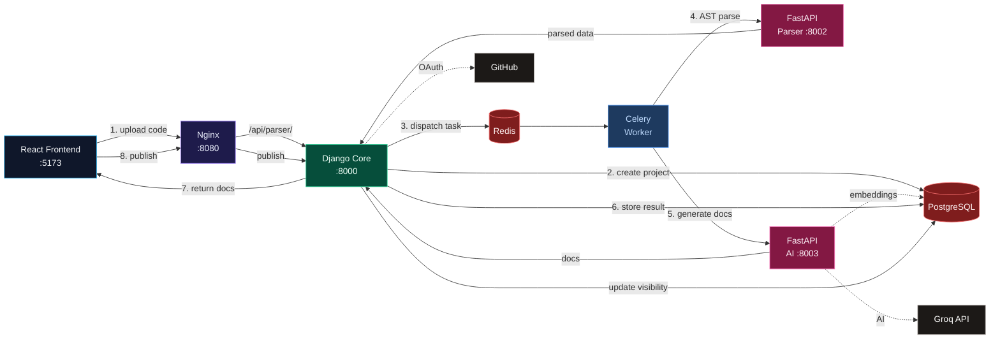

<div align="center">

# PyDocAI

### AI-Powered Documentation Generator for Any Language

[](LICENSE)
[](https://github.com/dennisjoseph2025/PyDocAI/stargazers)
[](https://github.com/dennisjoseph2025/PyDocAI/network/members)
[](https://pydocai.vercel.app)
[](https://www.djangoproject.com/)
[](https://react.dev/)

**Upload your code and let AI generate beautiful, comprehensive documentation in seconds.**

[🌐 Live Demo](https://pydocai.vercel.app) · [🐛 Report Bug](https://github.com/dennisjoseph2025/PyDocAI/issues) · [✨ Feature Request](https://github.com/dennisjoseph2025/PyDocAI/issues)

---

</div>

## Features

- **🤖 AI-Powered Documentation** — Parses your code and generates human-readable docs using Groq AI
- **🌐 Universal Language Support** — Works with Python, JavaScript, TypeScript, Java, Go, Rust, and more via AI-driven analysis
- **🐍 Python AST Mode** — Deep Python/Django code analysis with AST parsing for schema tables, endpoint mapping, and model relationships
- **📁 Multiple Input Methods** — Upload single `.py` files, `.zip` archives, paste raw code, or connect a GitHub repository
- **📊 Schema Generation** — Auto-compiled tables detailing database models, field types, constraints, and relationships (Python mode)
- **🔗 Endpoint Mapping** — Automated REST API documentation with HTTP methods, path parameters, and JSON responses (Python mode)
- **📝 Markdown Export** — Export documentation as clean Markdown, compatible with GitHub, GitLab, and VS Code
- **📢 Publish & Share** — Publish documentation publicly with shareable links and community comments
- **🔐 User Authentication** — JWT-based auth with GitHub OAuth, email/password registration, password reset
- **📱 Fully Responsive** — Mobile-first dark UI with slide-in sidebar navigation, works on phones, tablets, and desktops

## Tech Stack

| Layer | Technology |
|-------|-----------|
| **Frontend** | React 19, Vite, TypeScript, Tailwind CSS, React Router |
| **Backend** | Django 5, Django REST Framework, Celery, Redis |
| **Database** | PostgreSQL |
| **AI** | Groq API (LLaMA) |
| **Deployment** | Vercel (frontend), AWS EC2 + RDS + ElastiCache (backend) |

## Quick Start

### With Docker

```bash
docker-compose up --build -d
```

- Frontend: http://localhost:5173
- Backend API: http://localhost:8000
- API Docs (Swagger): http://localhost:8080/api/docs/
- Parser API Docs: http://localhost:8080/parser/docs/
- AI API Docs: http://localhost:8080/ai/docs/

### Without Docker

**Backend:**

```bash
cd backend
uv venv
uv run python manage.py migrate
uv run python manage.py runserver
```

**Frontend:**

```bash
cd frondend
npm install
npm run dev
```

## How It Works

### Python Mode (AST-powered)
```
1. Upload Code ──▶ 2. AST Parsing ──▶ 3. AI Generation ──▶ 4. Beautiful Docs
     │                    │                   │                    │
  .py / .zip          Python AST          Groq LLM           Markdown + UI
  GitHub repo        extracts types      writes docs         preview + export
```

### Universal Mode (AI-direct)
```
1. Upload Code ──▶ 2. AI Analysis ──▶ 3. Structured Docs
     │                    │                   │
  any language         Groq LLM           Tabbed README /
  (.py/.js/.ts/...)   analyzes code      API / Architecture
```

## Architecture




## Project Structure

```
PyDocAi/
├── deploy/
│   └── nginx.conf              # Reverse proxy config
├── services/
│   ├── core/                   # Django monolith (API hub)
│   │   ├── apps/               # 13 Django apps
│   │   │   ├── users/          # Auth (JWT, GitHub OAuth, password reset)
│   │   │   ├── projects/       # Project CRUD, publish, sharing
│   │   │   ├── parser/         # Python AST parsing orchestration
│   │   │   ├── ai/             # AI doc generation orchestration
│   │   │   ├── universal/      # Universal code analysis
│   │   │   ├── github_integration/ # GitHub repo fetching
│   │   │   ├── exports/        # Markdown export
│   │   │   ├── comments/       # Public doc comments
│   │   │   ├── feedback/       # User feedback & admin replies
│   │   │   ├── admin_dashboard/ # Admin stats & management
│   │   │   ├── notifications/  # Email notifications
│   │   │   ├── common/         # Shared utilities, health check
│   │   │   └── internal/       # Inter-service communication
│   │   ├── config/             # Django settings (base/dev/prod)
│   │   ├── docker/             # Dockerfile + entrypoint.sh
│   │   ├── env/                # .env + .env.example
│   │   ├── seed/               # seed_admin.py
│   │   ├── templates/emails/   # HTML email templates
│   │   ├── requirements/       # Pip requirements
│   │   └── manage.py
│   ├── parser/                 # FastAPI microservice (AST parsing)
│   │   ├── api/routes/         # file, folder, status, health
│   │   ├── ast_parser.py       # Core AST logic
│   │   ├── framework_detector.py
│   │   ├── docker/Dockerfile
│   │   └── main.py
│   └── ai/                     # FastAPI microservice (AI generation)
│       ├── api/routes/         # generate, status, health
│       ├── services/           # groq, docs_builder, markdown, prompts
│       ├── rag.py              # RAG-based code embedding
│       ├── docker/Dockerfile
│       └── main.py
├── frondend/                   # React 19 + Vite + Tailwind
│   └── src/
│       ├── pages/              # 19 route pages
│       │   ├── Home, Login, Register, ForgotPassword, ResetPassword
│       │   ├── Dashboard, Input, InputPython, InputUniversal
│       │   ├── Output, Profile, GitHubCallback
│       │   ├── Published, PublicDoc
│       │   ├── FeedbackPage, MyFeedback
│       │   ├── AdminUsers, AdminProjects, AdminFeedback
│       ├── components/         # 14 reusable UI components
│       ├── hooks/              # useAuth
│       ├── context/            # AuthContext
│       └── api/                # API client (index.js)
├── docker-compose.yml
├── docker-compose.prod.yml
└── README.md
```

## API Documentation

Full API reference with endpoint details, authentication, request/response examples, and error handling is available in [API_DOCS.md](API_DOCS.md).

Interactive Swagger UI (when running via Docker):

| Service | URL |
|---------|-----|
| Django Core API | `http://localhost:8080/api/docs/` |
| Parser Service | `http://localhost:8080/parser/docs/` |
| AI Service | `http://localhost:8080/ai/docs/` |

## Environment Variables

### Backend (`backend/.env`)

| Variable | Description |
|----------|-------------|
| `DJANGO_SECRET_KEY` | Django secret key |
| `DB_NAME`, `DB_USER`, `DB_PASSWORD` | PostgreSQL credentials |
| `DB_HOST`, `DB_PORT` | PostgreSQL host and port |
| `CELERY_BROKER_URL` | Redis URL for Celery broker |
| `GROQ_API_KEY` | Primary Groq AI API key |
| `GROQ_API_KEY_2` | Secondary Groq AI API key (fallback) |
| `GITHUB_CLIENT_ID` | GitHub OAuth app client ID |
| `GITHUB_CLIENT_SECRET` | GitHub OAuth app secret |
| `GITHUB_API_TOKEN` | GitHub API token for repo fetching |
| `EMAIL_HOST`, `EMAIL_PORT` | SMTP server settings |
| `EMAIL_HOST_USER`, `EMAIL_HOST_PASSWORD` | SMTP credentials |
| `FRONTEND_URL` | Frontend origin for CORS |
| `CORS_ALLOWED_ORIGINS` | Allowed CORS origins |
| `AWS_ACCESS_KEY_ID` | AWS S3 access key (production) |
| `AWS_SECRET_ACCESS_KEY` | AWS S3 secret key (production) |
| `AWS_STORAGE_BUCKET_NAME` | S3 bucket name (production) |

### Frontend (`frondend/.env`)

| Variable | Description |
|----------|-------------|
| `VITE_GITHUB_CLIENT_ID` | GitHub OAuth client ID for frontend login |

---

## Contributing

We welcome all contributions! See [CONTRIBUTING.md](CONTRIBUTING.md) for details.

**Ways to help:**
- 🐛 Report bugs via [GitHub Issues](https://github.com/dennisjoseph2025/PyDocAI/issues)
- 💡 Suggest features
- 🔧 Submit pull requests
- ⭐ Star the repo to show support

## License

Distributed under the MIT License. See [LICENSE](LICENSE) for more information.

---

<div align="center">

### ⭐ If you find this project useful, give it a star! ⭐

[](https://github.com/dennisjoseph2025/PyDocAI/stargazers)

Built with ❤️ for the Python community

</div>
